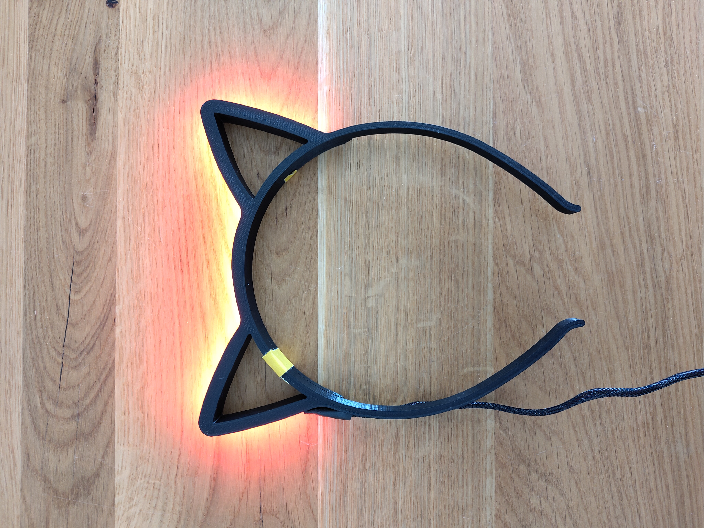
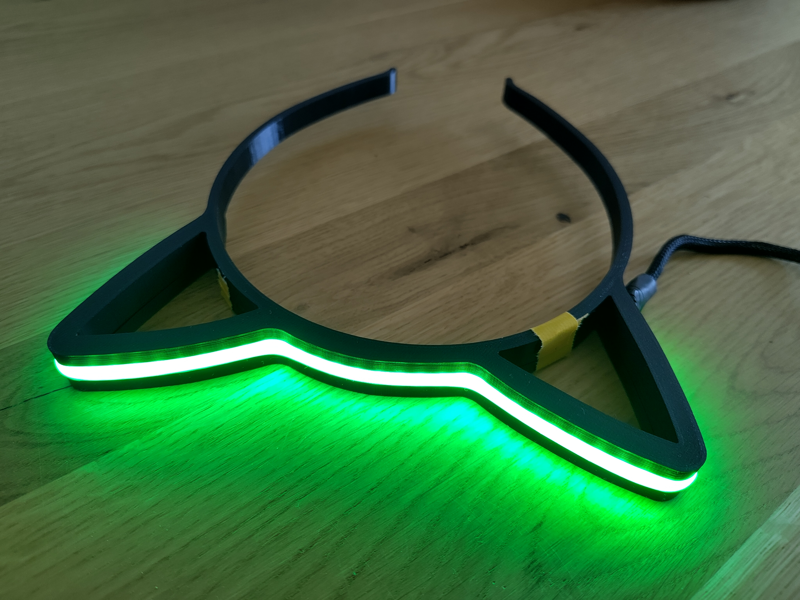

# catears

This repository contains everything you need to build your own brightly lit cat ear hairband with widely adopted electronics.

## Why?

This project got inspired by the satirical "Safety cat ears required" signs you might see in some hackspaces or at chaos events. Half joking I once said I will actually build "real" safety cat ears. This repository is the result of that.

## Build your own ones - Step by step!

### Item List

You will need the following items:

- Part 1 & 2 from the `models` folder printed with any 3D printer
- 1x ESP8266 (I am using a "Wemos D1 Mini")
- 1x a few centimeters of a WS2811 LED strip 
- A bunch of cables to solder everything together (preferably flexible cable)
  - Either use a 3 core sealed cable or wrap 3 wires with a cable sleeve
- A Micro-USB to USB cable (can be pretty short)
- A USB power source (e.g. a power bank)
- Optional: A connector to solder between microcontroller and cat ears (e.g. JST SM 3 Pin)
- Some glue or tape to connect the 3D printed parts

Further, access to the following tools is needed:

- A soldering station/kit
- A computer with docker for the initial setup

#### Alternative Hardware

You totally can use other hardware components - some notes on swapping parts:

**Microcontroller**

Every microcontroller supported by ESPHome should work. At least 1 GPIO pin should be accessible. Using a different microcontroller requires adopting the ESPHome config.

**LED strip**

Looks best with a silicon diffusor on top - strips are available with a pre-applied one. Search for "COB" or "FCOB" LED strips with the WS2811 chip set.

You can use any other LED strip supported by ESPHome and the neopixel integration. However, using a different chip set requires to adopt the ESPHome config accordingly.

The 3D models are designed to accomodate a 12mm wide LED strip with a 2.65mm wide silicon diffusor on top.

#### Fitting the 3D printed Hairband

You can scale the hairband according to your needs. I seem to have a pretty big head, so the supplied model already is pretty large. It is roughly 20% larger than the "usual" cat ear hairbands in my hackspace. 

To scale the models import them into your favorite slicer and scale the x/y axis for the same amount (do not touch the z axis/height).

### Putting it together

See [the manual](./manual.md).
