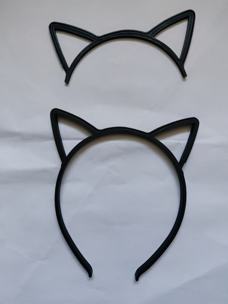
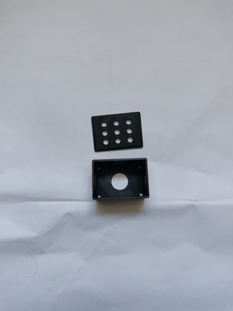
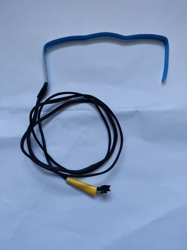
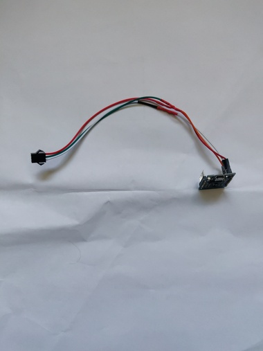
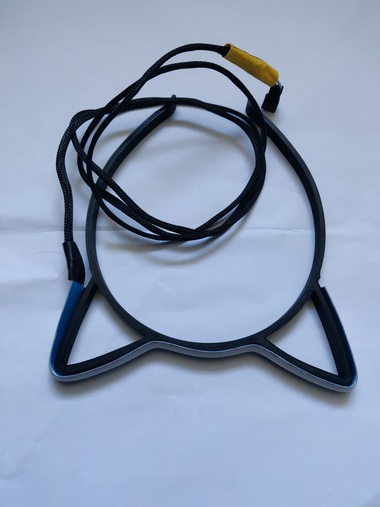
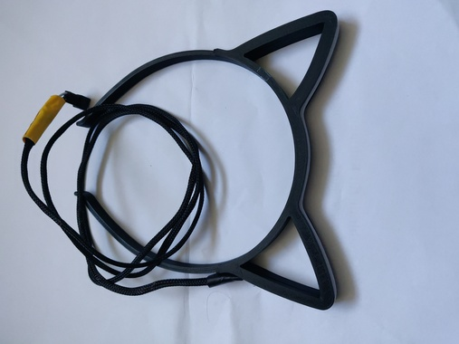
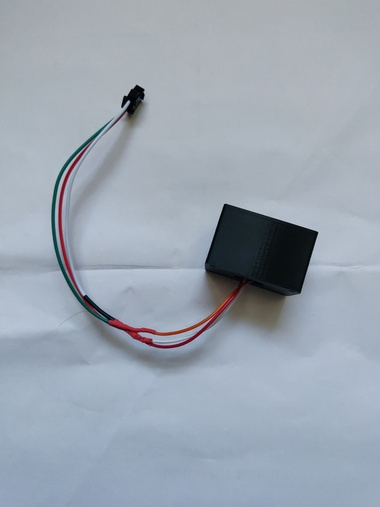
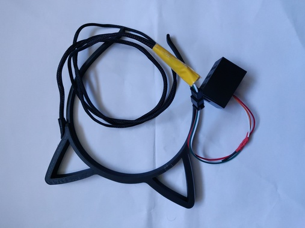

# Manual: Putting it together

1. Print the hairband. Part 1 & 2 are needed.
   
   
2. Print an enclosure for the microcontroller. I am using [this model](https://www.thingiverse.com/thing:4802020)

   
3. Solder wires to your LED strip and connect them with the microcontroller.
   1. You can use a connector between them to easily plug and unplug them. I am using a "JST SM" connector.
   2. To make things look way more nice I suggest covering the cables with some cable sleeves.
   3. The LED strip runs on 5V.
   4. Connect the data wire of the LED strip to your microcontrollers `GPIO3` pin.
   
   
   
4. Assemble the models.
   1. Put the LED strip into the thin groove along the top of the hairband of the bigger of the 2 models.
   2. Cut the LED strip to size.
   
   

   3. Put the second, smaller part on top and make sure the LED strip is fitting into its groove as well.
   4. Glue the parts together or use 2 thin strips of tape to hold them together.
   
   
5. Flash the microcontroller.
   1. Copy `esphome/secrets.example.yaml` to `esphome/secrets.yaml` and set your secrets.
   2. Connect the microcontroller to your computer via a USB cable.
   3. In a terminal run `(cd esphome && docker compose up)`
   4. Navigate your browser to `http://127.0.0.1:6052`.
   5. LogIn with user `admin` and password `admin`.
   6. Using the UI upload the `catears.yaml` to your microcontroller.
6. Put the microcontroller into the enclosure and connect everything.
   
   
   
7. Verify everything is working.
   1. Power the microcntroller (either by your computer or an external power source).
   2. Navigate your browser to `http://catears.local/`, the ESPHome dashboard should be visible.
      - In case the given WiFi is not reachable the ESP will offer an access point called "catear" connect to it via the `ap_password` and navigate to `192.168.4.1` where the dashboard is located at 
   3. You can change the brightness, color and effects from this dashboard.
